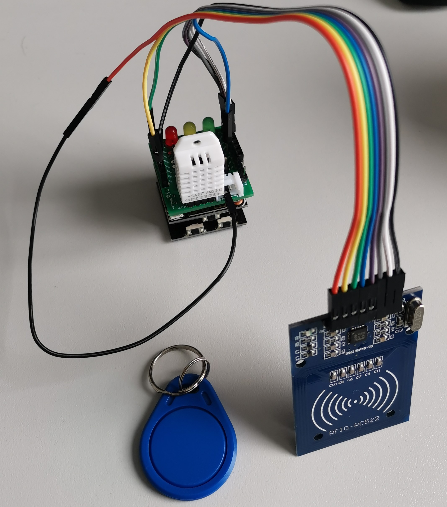

# EscapeRoom Install

## Installation von git unter Linux

Führe die folgenden Befehle aus, um `git` auf einem Linux-System zu installieren:

```bash
sudo apt update
sudo apt install git
```

## Apache2-Konfiguration

Installation von Apache2

```bash
sudo apt update
sudo apt install apache2 
```

Füge die folgende Konfiguration zu den Directories zur `/etc/apache2/apache2.conf` hinzu, um den Zugriff auf das Verzeichnis der Skripte zu ermöglichen:

```apache
<Directory "/usr/lib/cgi-bin/Watchpulse">
    Options Indexes FollowSymLinks
    AllowOverride None
    Require all granted
</Directory>
```

Füge die folgende Konfiguration zur `/etc/apache2/sites-available/000-default.conf` hinzu, um den Zugriff auf das Verzeichnis der CGI-Skripte zu ermöglichen:

```apache
<VirtualHost *:80>
    # ...

    DocumentRoot /lib/cgi-bin/EscapeRoom

    # ...

    <Directory "/home/mqtt/">
        AllowOverride None
        Options +ExecCGI -MultiViews +SymLinksIfOwnerMatch
        Require all granted
    </Directory>

    ProxyPassMatch          "/ws$"  ws://127.0.0.1:9001

</VirtualHost>
```

Nach den Änderungen muss der Apache Server neu gestartet werden:

```bash
service apache2 restart
```

## Dateien von Git herunterladen

Lade die Watch-Pulse Dateien in deinen Projekt-Ordner herunter

```bash
cd /home/mqtt/
sudo git clone https://github.com/lilbone/EscapeRoom.git
```

Anschließend musst du noch den Benutzer anpassen:

```bash
sudo chown -R www-data:www-data /home/mqtt/Watchpulse
sudo chmod -R +x /home/mqtt/Watchpulse
```

## ESP8266 vorbereiten



* Taster / LED / Senor erweiterung aufstecken
* DHT-22 mit Sensor-Schnittstelle verbinden
* RFID Chip-Reader wie folgt verbinden:
  * Orange 3,3v   -> 3,3v
  * Gelb RST      -> 3 RXD
  * Schwarz SDA   -> 5
  * Grün GND      -> GND
  * Weiß SCK      -> 14
  * Lila MISO     -> 12
  * Grau MOSI     -> 13
